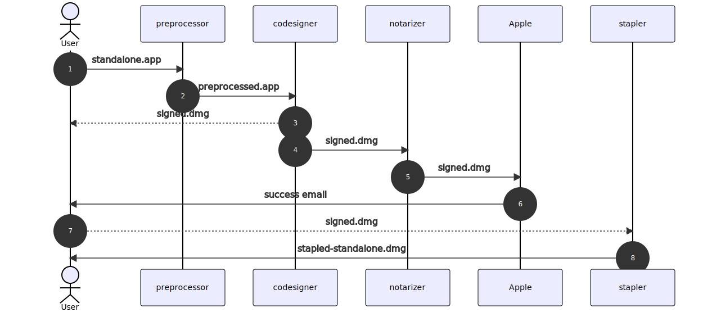

# Workflows

There are four workflows which are differentiated by choice of distribution packaging.

## A. Simple Case for zip archives

1. Sign the app.
2. Zip it.
3. Notarise it.
4. Take the app from step 1 and staple it.
5. Zip it.
6. Ship the zip archive from step 5.

### standalone.py - zip workflow

Case A is implemented in `standalone.py` as follows:

1. (optional) standalone.preprocess(a.app)
    -> preprocessed.app

2. standalone.codesign(a.app | a-preprocessed.app)
    -> signed.app to User
    -> signed.zip

3. standalone.notarize(signed.zip)
    -> signed.zip to Apple
    if User receives success email, continue

4. standalone.staple(signed.app) (from 2)
    -> stapled.app

5. standalone.distribute(export_dir/stapled.app)
    -> app-distribution.zip

## B. Simple case for pkg installer and dmg archives

### pkg

Case A is implemented in `standalone.py` as follows:

1. (optional) standalone.preprocess(a.app)
    -> preprocessed.app

2. standalone.codesign(a.app | a-preprocessed.app)
    -> signed.pkg to User
    -> signed.pkg

3. standalone.notarize(signed.pkg)
    -> signed.pkg to Apple
    if User receives success email, continue

4. standalone.staple(signed.pkg) (from 2)
    -> stapled.pkg

5. standalone.distribute(export_dir/stapled.pkg)
    -> app-distribution.zip

### dmg

Case A is implemented in `standalone.py` as follows:

1. (optional) standalone.preprocess(a.app)
    -> preprocessed.app

2. standalone.codesign(a.app | a-preprocessed.app)
    -> signed.pkg to User
    -> signed.dmg

3. standalone.notarize(signed.pkg)
    -> signed.pkg to Apple
    if User receives success email, continue

4. standalone.staple(signed.pkg) (from 2)
    -> stapled.dmg
    -> app-distribution.dmg

## C. Complex Case for nested pkg installer inside dmg archives

NOT YET IMPLEMENTED

This entails signing all your code from the inside out, up to and including any signable containers. Then notarizing and stapling the outermost container, which is shipped.

1. Sign the app
2. Sign the installer package
3. Sign the disk image
4. Notarize disk image
5. Staple disk image

### standalone.py - pkg

Case B is implemented in `standalone.py` as follows:

1. (optional) standalone.preprocess(a.app) -> a-preprocessed.app

2. standalone.codesign(a.app | a-preprocessed.app)
    -> a-signed.app

3. standalone.codesign_as_pkg(a-signed.app)
    -> a-signed.pkg

4. standalone.codesign_as_dmg(export_dir/a-signed.pkg)
    -> a-signed.dmg

5. standalone.notarize_dmg(a-signed.dmg)
    if notarize_result_fails:
        stop_process

6. standalone.staple_dmg(a-signed.dmg)

7. ship a-signed.dmg
